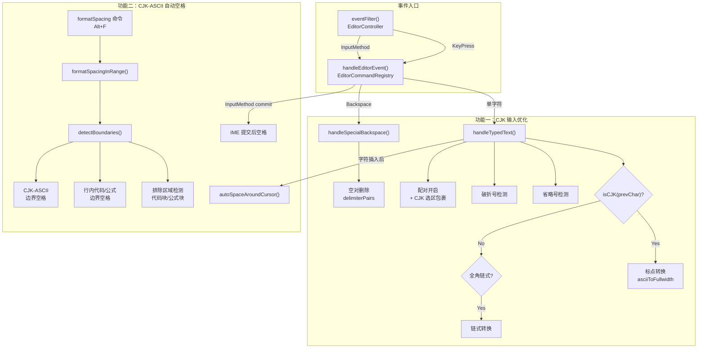

# CJK 输入优化与自动空格 — 实施计划

## 目标

在 ScratchEditor 中实现两组功能：
1. **功能一：CJK 输入优化** — 标点自动转换、省略号/破折号合并、括号配对增强、选区 CJK 包裹
2. **功能二：CJK 与 ASCII 自动空格** — 输入时自动整理 + 手动命令整理

## 现有代码状态（经源码逐行验证）

> [!IMPORTANT]
> 第一轮研究子代理对功能一的多项报告为**虚构内容**（hallucination）。以下结论均经过 `grep` 和源码直读双重验证。

### ✅ 已实现

| 功能 | 位置 |
|------|------|
| CJK 括号/引号/书名号**自动配对** | [`delimiterPairs()`](file:///D:/_Dev/ScratchEditor/src/editorcommandregistry.cpp#L47-L76)：`（）`、`【】`、`《》`、`「」`、`『』`、`""`、`''` 等 24 对 |
| 闭合符号**跳过**（键盘输入） | [`handleTypedText()`](file:///D:/_Dev/ScratchEditor/src/editorcommandregistry.cpp#L1559-L1563) |
| 闭合符号**跳过**（IME 提交） | [`completeInputMethodCommit()`](file:///D:/_Dev/ScratchEditor/src/editorcommandregistry.cpp#L1941-L1953) |
| **包裹选区**（键盘和 IME） | [`insertPair()`](file:///D:/_Dev/ScratchEditor/src/editorcommandregistry.cpp#L1567-L1586) + [`completeInputMethodCommit()`](file:///D:/_Dev/ScratchEditor/src/editorcommandregistry.cpp#L1955-L1978) |
| **Tab 跳出**闭合符号 | [`jumpOutOfPair()`](file:///D:/_Dev/ScratchEditor/src/editorcommandregistry.cpp#L1788-L1871)：基于 delimiter 栈算法 |
| `……` 和 `——` 的**整体退格** | [`handleSpecialBackspace()`](file:///D:/_Dev/ScratchEditor/src/editorcommandregistry.cpp#L1684-L1692) |
| Markdown 标记空对退格 | `***`、`**`、`*`、`` ` ``、` ```\n``` ` |

### ❌ 未实现（需新增）

| 功能 | 说明 |
|------|------|
| `isCJK()` 辅助函数 | 代码中不存在任何 CJK Unicode 范围检测 |
| CJK 后 ASCII 标点→全角 | `, . : ? ! ; ( )` 转换不存在 |
| 全角标点链式转换 | `，,`→`，，`、`。.`→`。。` 不存在 |
| `...` / `。。。` → `……` | 省略号转换不存在 |
| CJK 后 `--` → `——` | 破折号转换不存在 |
| 括号配对**空删** | `()`, `""`, `（）`, `「」` 等空对退格不存在（只有 Markdown 标记） |
| 选区含 CJK 时半角→全角包裹 | 不存在 |
| CJK-ASCII 自动空格（输入时） | 不存在 |
| CJK-ASCII 自动空格（手动命令） | 不存在 |
| 行内代码/公式边界空格 | 不存在 |

---

## User Review Required

> [!IMPORTANT]
> **需求中提到「命令面板」**，本项目使用的是 ScratchEditor 自有的 `EditorCommandRegistry` 命令系统。计划将按 ScratchEditor 现有架构实现命令注册。

> [!WARNING]
> **关于行内公式 `$...$`**：当前 ScratchEditor 的 Markdown 高亮器不处理行内公式。自动空格功能中对 `$...$` 边界的处理将基于纯文本模式匹配实现，不依赖高亮器状态。

---

## Open Questions（已全部解决）

- **Q1** ✅：CJK 后 `(` → `（）` 配对（转换+配对一步完成）。
- **Q2** ✅：`)` 先尝试跳过闭合 `）`，跳过失败且前字符为 CJK 时转为 `）`。
- **Q3** ❌ 已移除：选区含 CJK 时 `<` 不转换为 `《》`。`<>` 保留原有行为。
- **Q4** ✅：IME 提交的全角标点不做二次转换，只在键盘直接输入时执行标点转换。

---

## 架构概览



---

## Proposed Changes

### 模块一：CJK 字符检测基础设施

#### [MODIFY] [editorcommandregistry.cpp](file:///D:/_Dev/ScratchEditor/src/editorcommandregistry.cpp)

在文件顶部匿名命名空间中（`delimiterPairs()` 前，约 line 47 之前）添加 CJK 检测函数：

```cpp
// --- CJK character classification ---

bool isCJK(QChar ch)
{
    const char16_t u = ch.unicode();
    // CJK Unified Ideographs
    if (u >= 0x4E00 && u <= 0x9FFF) return true;
    // CJK Extension A
    if (u >= 0x3400 && u <= 0x4DBF) return true;
    // Hiragana
    if (u >= 0x3040 && u <= 0x309F) return true;
    // Katakana + Phonetic Extensions
    if (u >= 0x30A0 && u <= 0x30FF) return true;
    if (u >= 0x31F0 && u <= 0x31FF) return true;
    // Hangul Jamo
    if (u >= 0x1100 && u <= 0x11FF) return true;
    // Hangul Compatibility Jamo
    if (u >= 0x3130 && u <= 0x318F) return true;
    // Hangul Syllables
    if (u >= 0xAC00 && u <= 0xD7AF) return true;
    return false;
}

bool isAsciiAlnum(QChar ch)
{
    return (ch >= u'A' && ch <= u'Z')
        || (ch >= u'a' && ch <= u'z')
        || (ch >= u'0' && ch <= u'9');
}
```

Unicode 范围与用户需求完全一致。**注意不包含全角标点和 CJK 符号区**（`0x3000-0x303F`、`0xFF01-0xFF60`）——这些是标点符号，不应触发 CJK-ASCII 空格规则。

---

### 模块二：CJK 标点自动转换

#### [MODIFY] [editorcommandregistry.cpp](file:///D:/_Dev/ScratchEditor/src/editorcommandregistry.cpp) — `handleTypedText()`

在 `handleTypedText()` 函数中，**现有的 `-` 自动展开逻辑之后、backtick 处理之前**（约 line 1528），插入标点转换逻辑：

```cpp
// --- CJK punctuation auto-conversion ---
if (!hasSelection && text.size() == 1) {
    const QChar ch = text.at(0);
    
    // 1. Ellipsis: ..., 。。。, 。。., etc. → ……
    if (ch == u'.' || ch == u'\u3002') {
        if (start >= 2) {
            const QString prev2 = documentText.mid(start - 2, 2);
            const bool isEllipsis =
                prev2 == QStringLiteral("..")
                || prev2 == QStringLiteral("\u3002\u3002")       // 。。
                || prev2 == QStringLiteral("\u3002.")             // 。.
                || prev2 == QStringLiteral(".\u3002");            // .。
            if (isEllipsis) {
                QTextCursor cursor(m_document);
                cursor.setPosition(start - 2);
                cursor.setPosition(start, QTextCursor::KeepAnchor);
                cursor.beginEditBlock();
                cursor.insertText(QStringLiteral("\u2026\u2026"));  // ……
                cursor.endEditBlock();
                m_editor->setProperty("cursorPosition", start);
                focusEditor();
                return true;
            }
        }
    }
    
    // 2. Em-dash: CJK-- → CJK——
    if (ch == u'-' && start >= 2) {
        if (documentText.at(start - 1) == u'-') {
            const QChar beforeDash = documentText.at(start - 2);
            if (isCJK(beforeDash)) {
                QTextCursor cursor(m_document);
                cursor.setPosition(start - 1);
                cursor.setPosition(start, QTextCursor::KeepAnchor);
                cursor.beginEditBlock();
                cursor.insertText(QStringLiteral("\u2014\u2014"));  // ——
                cursor.endEditBlock();
                m_editor->setProperty("cursorPosition", start + 1);
                focusEditor();
                return true;
            }
        }
    }
    
    // 3. ASCII punctuation after CJK → fullwidth
    if (start > 0 && isCJK(documentText.at(start - 1))) {
        static const QHash<char16_t, char16_t> asciiToFullwidth = {
            {u',', 0xFF0C},   // ，
            {u'.', 0x3002},   // 。
            {u':', 0xFF1A},   // ：
            {u'?', 0xFF1F},   // ？
            {u'!', 0xFF01},   // ！
            {u';', 0xFF1B},   // ；
            {u')', 0xFF09},   // ）
        };
        // ( after CJK: insert （） pair
        if (ch == u'(') {
            return insertPair(QStringLiteral("\uFF08"), QStringLiteral("\uFF09"));
        }
        auto it = asciiToFullwidth.find(ch.unicode());
        if (it != asciiToFullwidth.end()) {
            QTextCursor cursor(m_document);
            cursor.setPosition(start);
            cursor.insertText(QString(QChar(*it)));
            m_editor->setProperty("cursorPosition", start + 1);
            focusEditor();
            return true;
        }
    }
    
    // 4. Chained fullwidth: ，, → ，，  。. → 。。
    if (start > 0) {
        const QChar prev = documentText.at(start - 1);
        if ((prev == u'\uFF0C' && ch == u',')
            || (prev == u'\u3002' && ch == u'.')) {
            const QChar full = (ch == u',') ? QChar(0xFF0C) : QChar(0x3002);
            QTextCursor cursor(m_document);
            cursor.setPosition(start);
            cursor.insertText(QString(full));
            m_editor->setProperty("cursorPosition", start + 1);
            focusEditor();
            return true;
        }
    }
}
```

**设计决策**：
- 省略号检测在 CJK 标点转换之前执行，否则 `CJK..` 的第三个 `.` 会先被转为 `。` 而不是触发省略号
- `(` 触发的是 `（）` 配对而非单个字符插入
- `)` 走跳过逻辑（现有 `isClosingDelimiter`）；跳过失败且前字符为 CJK 时，转为 `）`

---

### 模块三：括号空对退格删除

#### [MODIFY] [editorcommandregistry.cpp](file:///D:/_Dev/ScratchEditor/src/editorcommandregistry.cpp) — `handleSpecialBackspace()`

在 `……`/`——` 整体删除之后、fence block 检测之前（约 line 1693），加入 delimiter pair 空对删除：

```cpp
// Empty delimiter pair deletion: cursor between opening+closing with nothing inside
if (removeStart < 0) {
    const auto &pairs = delimiterPairs();
    for (const auto &pair : pairs) {
        const int openLen = pair.opening.size();
        const int closeLen = pair.closing.size();
        if (start >= openLen
            && start + closeLen <= text.size()
            && text.mid(start - openLen, openLen) == pair.opening
            && text.mid(start, closeLen) == pair.closing) {
            removeStart = start - openLen;
            removeEnd = start + closeLen;
            break;
        }
    }
}
```

这会复用已有的 `delimiterPairs()` 表，覆盖所有 24 对——包括 `()`、`[]`、`{}`、`（）`、`【】`、`《》`、`「」`、`『』`、`""`、`''` 等。

---

### 模块四：选区含 CJK 时半角→全角包裹

#### [MODIFY] [editorcommandregistry.cpp](file:///D:/_Dev/ScratchEditor/src/editorcommandregistry.cpp) — `handleTypedText()`

修改现有的 `pairForOpening` 分支（line 1550），在有选区时检查选区是否含 CJK，如含则将半角转为全角：

```cpp
if (const DelimiterPair *pair = pairForOpening(text)) {
    // ... existing skip-over logic for symmetric pairs (line 1551-1554) ...
    
    // CJK-aware selection wrapping
    if (hasSelection) {
        const QString selection = m_document->toPlainText().mid(start, end - start);
        bool selectionHasCJK = false;
        for (const QChar &c : selection) {
            if (isCJK(c)) { selectionHasCJK = true; break; }
        }
        if (selectionHasCJK) {
            static const QHash<QString, std::pair<QString, QString>> halfToFull = {
                {QStringLiteral("("),  {QStringLiteral("\uFF08"), QStringLiteral("\uFF09")}},
                {QStringLiteral("["),  {QStringLiteral("\u3010"), QStringLiteral("\u3011")}},
                {QStringLiteral("\""), {QStringLiteral("\u201C"), QStringLiteral("\u201D")}},
                {QStringLiteral("'"),  {QStringLiteral("\u2018"), QStringLiteral("\u2019")}},
            };
            auto it = halfToFull.find(pair->opening);
            if (it != halfToFull.end()) {
                return insertPair(it->second.first, it->second.second);
            }
        }
    }
    
    return insertPair(pair->opening, pair->closing);
}
```

---

### 模块五：CJK-ASCII 自动空格（输入时）

#### [MODIFY] [editorcommandregistry.h](file:///D:/_Dev/ScratchEditor/src/editorcommandregistry.h)

添加新的私有方法声明：

```cpp
private:
    // CJK-ASCII auto-spacing
    void autoSpaceAroundCursor(int position);
    static bool isSoftSeparator(QChar ch);
    static bool isInsideFencedCode(const QString &text, int position);  // 可能已存在
    static bool isInsideBlockFormula(const QString &text, int position);
```

#### [MODIFY] [editorcommandregistry.cpp](file:///D:/_Dev/ScratchEditor/src/editorcommandregistry.cpp)

##### 5.1 软分隔符检测

```cpp
bool isSoftSeparator(QChar ch)
{
    // Fullwidth separators
    static const QSet<char16_t> fullwidthSeps = {
        0xFF0C, 0x3002, 0x3001, 0xFF1F, 0xFF01, 0xFF1A, 0xFF1B,  // ，。、？！：；
        0x201C, 0x201D, 0x2018, 0x2019,                            // ""''
        0xFF08, 0xFF09, 0x3010, 0x3011, 0x300A, 0x300B,            // （）【】《》
        0x300C, 0x300D, 0x300E, 0x300F,                            // 「」『』
    };
    if (fullwidthSeps.contains(ch.unicode())) return true;
    
    // Halfwidth separators
    static const QSet<char16_t> halfwidthSeps = {
        u',', u'.', u'?', u'!', u':', u';', u'"', u'\'',
        u'-', u'(', u')', u'[', u']', u'{', u'}',
    };
    return halfwidthSeps.contains(ch.unicode());
}
```

##### 5.2 排除区域检测

`isInsideFencedCode()` 已在现有代码中存在（被 heading backspace 使用，line 1672）。需要新增 `isInsideBlockFormula()`：

```cpp
bool isInsideBlockFormula(const QString &text, int position)
{
    // Scan for $$ delimiters before position
    int depth = 0;
    int i = 0;
    while (i < position) {
        if (i + 1 < text.size() && text.at(i) == u'$' && text.at(i + 1) == u'$') {
            // Check it's at line start (after optional whitespace)
            int lineStart = text.lastIndexOf(u'\n', qMax(0, i - 1)) + 1;
            bool atLineStart = true;
            for (int j = lineStart; j < i; ++j) {
                if (!text.at(j).isSpace()) { atLineStart = false; break; }
            }
            if (atLineStart) {
                depth = 1 - depth;
                i += 2;
                continue;
            }
        }
        ++i;
    }
    return depth > 0;
}
```

##### 5.3 行内代码/公式边界检测

```cpp
struct InlineSpan {
    int start;  // position of opening delimiter (first ` or $)
    int end;    // position after closing delimiter
};

// Find inline code span (`...`) or inline formula ($...$) containing or adjacent to position
std::optional<InlineSpan> findInlineSpanAt(const QString &text, int lineStart, int lineEnd, int position);
```

##### 5.4 自动空格核心

```cpp
void EditorCommandRegistry::autoSpaceAroundCursor(int cursorPosition)
{
    const QString text = m_document->toPlainText();
    if (cursorPosition <= 0 || cursorPosition >= text.size()) return;
    
    // Skip if inside fenced code or block formula
    if (isInsideFencedCode(text, cursorPosition)) return;
    if (isInsideBlockFormula(text, cursorPosition)) return;
    
    QTextCursor cursor(m_document);
    cursor.beginEditBlock();
    
    int offset = 0;  // track position shifts from insertions
    
    // Check boundary to the LEFT of cursor: text[pos-1] vs text[pos]
    {
        int pos = cursorPosition + offset;
        if (pos > 0 && pos < text.size()) {
            QChar left = text.at(pos - 1);
            QChar right = text.at(pos);
            if (left != u' ' && right != u' ' && left != u'\n' && right != u'\n') {
                bool needSpace = false;
                if (isCJK(left) && isAsciiAlnum(right)) needSpace = true;
                if (isAsciiAlnum(left) && isCJK(right)) needSpace = true;
                // Also check inline code/formula boundaries
                // (skip if either side is a soft separator)
                if (needSpace && !isSoftSeparator(left) && !isSoftSeparator(right)) {
                    cursor.setPosition(pos);
                    cursor.insertText(QStringLiteral(" "));
                    offset += 1;
                }
            }
        }
    }
    
    cursor.endEditBlock();
    m_editor->setProperty("cursorPosition", cursorPosition + offset);
    focusEditor();
}
```

##### 5.5 集成到输入流

在 `handleTypedText()` 返回 `false`（未处理）时，Qt 默认插入字符。之后需要在**字符插入完成后**触发 `autoSpaceAroundCursor()`。

**实现方式**：在 `handleEditorEvent()` 中，当 `handleTypedText()` 返回 `false` 时，使用 `QTimer::singleShot(0, ...)` 延迟调用：

```cpp
// In handleEditorEvent(), after line 779:
if (!(modifiers & (Qt::ControlModifier | Qt::AltModifier | Qt::MetaModifier))
    && !keyEvent->text().isEmpty()) {
    if (handleTypedText(keyEvent->text())) {
        return true;
    }
    // Schedule auto-spacing after Qt inserts the character
    QTimer::singleShot(0, this, [this] {
        const int pos = m_editor->property("cursorPosition").toInt();
        autoSpaceAroundCursor(pos);
    });
    return false;
}
```

同样地，`handleTypedText()` 返回 `true`（已处理标点转换等）后，也需要在转换完成后调用 `autoSpaceAroundCursor()`。

对于 **IME 提交**：在 `completeInputMethodCommit()` 末尾和 IME 非配对提交时，同样延迟触发 `autoSpaceAroundCursor()`。需要在 `handleEditorEvent()` 的 `InputMethod` 分支中，对**不匹配配对的提交文本**也调度空格检查：

```cpp
// In handleEditorEvent(), InputMethod branch (after line 806):
if (!relevant && !committedText.isEmpty()) {
    const int imeStart = start;
    const int commitLen = committedText.size();
    QTimer::singleShot(0, this, [this, imeStart, commitLen] {
        // Check spacing at both boundaries of the committed text
        autoSpaceAroundCursor(imeStart);
        autoSpaceAroundCursor(imeStart + commitLen);
    });
}
```

##### 5.6 行内代码/公式的外围空格

`autoSpaceAroundCursor()` 还需检测行内代码（`` ` ``）和行内公式（`$`）边界。当光标在行内代码/公式的开/闭标记旁边时，应用软空格规则：

```cpp
// After CJK-ASCII check, add inline span boundary check:
// If cursor is right after closing ` or $ of inline span:
//   check left-of-span boundary (char before opening delimiter vs opening delimiter)
// If cursor is right before opening ` or $ of inline span:
//   check right-of-span boundary (closing delimiter vs char after closing delimiter)
// Apply soft separator rule: skip if separator present, else insert space
```

---

### 模块六：手动格式整理命令

#### [MODIFY] [editorcommandregistry.cpp](file:///D:/_Dev/ScratchEditor/src/editorcommandregistry.cpp) — 命令注册

在 `m_definitions` 初始化列表中（约 line 591，`settings` 条目之后），添加新命令：

```cpp
{QStringLiteral("formatSpacing"), QStringLiteral("整理选区或当前行格式"),
 QStringLiteral("编辑"), QStringLiteral("Alt+F"), {}, false},
```

#### [MODIFY] [editorcommandregistry.cpp](file:///D:/_Dev/ScratchEditor/src/editorcommandregistry.cpp) — 命令执行

在 `execute()` 函数的路由表中添加：

```cpp
if (commandId == QStringLiteral("formatSpacing")) {
    formatSpacing();
    return;
}
```

#### [MODIFY] [editorcommandregistry.h](file:///D:/_Dev/ScratchEditor/src/editorcommandregistry.h)

```cpp
void formatSpacing();
void formatSpacingInRange(int rangeStart, int rangeEnd);
```

#### [MODIFY] [editorcommandregistry.cpp](file:///D:/_Dev/ScratchEditor/src/editorcommandregistry.cpp) — 实现

```cpp
void EditorCommandRegistry::formatSpacing()
{
    const int start = m_editor->property("selectionStart").toInt();
    const int end = m_editor->property("selectionEnd").toInt();
    
    if (start != end) {
        // 有选区：只整理选区内部
        formatSpacingInRange(start, end);
    } else {
        // 无选区：整理当前行
        const QString text = m_document->toPlainText();
        const int lineStart = text.lastIndexOf(u'\n', qMax(0, start - 1)) + 1;
        int lineEnd = text.indexOf(u'\n', start);
        if (lineEnd < 0) lineEnd = text.size();
        
        // 当前行在代码块或公式块内时不处理
        if (isInsideFencedCode(text, lineStart)) return;
        if (isInsideBlockFormula(text, lineStart)) return;
        
        formatSpacingInRange(lineStart, lineEnd);
    }
}

void EditorCommandRegistry::formatSpacingInRange(int rangeStart, int rangeEnd)
{
    const QString text = m_document->toPlainText();
    QTextCursor cursor(m_document);
    cursor.beginEditBlock();
    
    int offset = 0;  // cumulative position shift
    
    for (int i = rangeStart; i < rangeEnd + offset - 1; ++i) {
        const int origI = i - offset;
        
        // Skip fenced code blocks and block formulas within range
        // Skip contents of inline code/formula (only process boundaries)
        
        const QString currentText = m_document->toPlainText();
        const QChar left = currentText.at(i);
        const QChar right = currentText.at(i + 1);
        
        if (left == u' ' || right == u' ' || left == u'\n' || right == u'\n') continue;
        if (isSoftSeparator(left) || isSoftSeparator(right)) continue;
        
        bool needSpace = false;
        // CJK-ASCII boundary
        if (isCJK(left) && isAsciiAlnum(right)) needSpace = true;
        if (isAsciiAlnum(left) && isCJK(right)) needSpace = true;
        // Inline code/formula boundary (` or $ adjacent to CJK/ASCII)
        // ... similar logic ...
        
        if (needSpace) {
            QTextCursor ins(m_document);
            ins.setPosition(i + 1);
            ins.insertText(QStringLiteral(" "));
            offset += 1;
            ++i;  // skip the space we just inserted
        }
    }
    
    cursor.endEditBlock();
    focusEditor();
}
```

**关键约束**：
- `cursor.beginEditBlock()` / `endEditBlock()` 确保一次撤销恢复全部修改
- 不触发 `autoSpaceAroundCursor()`（手动命令不是输入事件）
- 代码块和公式块内部跳过

---

### 模块七：测试

#### [MODIFY] [tests/editing_main.cpp](file:///D:/_Dev/ScratchEditor/tests/editing_main.cpp)

添加新的测试用例组：

```text
=== CJK Punctuation Conversion ===
- CJK 后输入 , → ，
- CJK 后输入 . → 。
- CJK 后输入 : → ：
- CJK 后输入 ? → ？
- CJK 后输入 ! → ！
- CJK 后输入 ; → ；
- CJK 后输入 ( → （）（配对）
- CJK 后输入 ) → ）
- ，后输入 , → ，，
- 。后输入 . → 。。
- ... → ……
- 。。。 → ……
- 。。. → ……
- CJK-- → CJK——

=== CJK Selection Wrapping ===
- 选区含 CJK 时 ( → （选区）
- 选区含 CJK 时 [ → 【选区】
- 选区含 CJK 时 < → 《选区》
- 选区含 CJK 时 " → "选区"
- 选区含 CJK 时 ' → '选区'
- 选区无 CJK 时 ( → (选区)

=== Bracket Pair Backspace ===
- 光标在 () 中间退格 → 删除配对
- 光标在 （） 中间退格 → 删除配对
- 光标在 「」 中间退格 → 删除配对

=== CJK-ASCII Auto-Spacing (Input Time) ===
- 输入 CJK 后紧接 ASCII 字母 → 自动加空格
- 输入 ASCII 字母后紧接 CJK → 自动加空格
- 已有空格不重复添加
- 标点分隔不加空格
- 代码块内不触发
- 粘贴不触发

=== Format Spacing Command ===
- 中文ABC → 中文 ABC
- ABC中文 → ABC 中文
- 中文123 → 中文 123
- Python3 → Python3（不变）
- 中文，ABC → 不变
- 中文`code`中文 → 中文 `code` 中文
- 中文，`code` → 不变
- 代码块内不处理
- 有选区只处理选区
- 无选区只处理当前行
- 一次撤销恢复全部
```

---

## Verification Plan

### Automated Tests

```powershell
# 构建 editing preset
./scripts/build.ps1 -Preset editing -SkipLocalInstall

# 运行编辑行为测试
./scripts/run-editing-tests.ps1 `
  -BuildSubdirectory build\editing `
  -OriginalAhkPath D:\Documents\AutoHotkey\KeysRedirect.ahk.stage6-backup-20260802-132834
```

### Manual Verification

1. **标点转换**：启动编辑器，输入「中文」后依次按 `, . : ? ! ; ( )`，确认全部自动转为全角
2. **省略号**：输入 `...`，确认变为 `……`
3. **破折号**：输入「中文」后按 `--`，确认变为 `——`
4. **选区包裹**：选中含中文的文本，按 `(`，确认用 `（）` 包裹
5. **空对退格**：输入 `(`（生成 `()`），按退格，确认整对删除
6. **自动空格**：输入 `中文ABC`，确认自动变为 `中文 ABC`
7. **粘贴不触发**：粘贴 `中文ABC`，确认不自动加空格
8. **Alt+F 命令**：输入 `中文ABC`（粘贴），按 `Alt+F`，确认变为 `中文 ABC`
9. **代码块排除**：在 ` ```代码块``` ` 内输入 `中文ABC`，确认不自动加空格
10. **行内代码边界**：输入 `中文\`code\`中文`，确认两侧自动加空格
11. **微软拼音**：用输入法输入中文后切换英文输入字母，确认空格正常

---

## 变更文件清单

| 文件 | 类型 | 变更内容 |
|------|------|---------|
| `src/editorcommandregistry.cpp` | MODIFY | 新增 `isCJK()`、`isAsciiAlnum()`、`isSoftSeparator()`、`isInsideBlockFormula()`、标点转换、选区CJK包裹、空对退格、`autoSpaceAroundCursor()`、`formatSpacing()`、`formatSpacingInRange()`、IME 空格集成 |
| `src/editorcommandregistry.h` | MODIFY | 新增方法声明 |
| `tests/editing_main.cpp` | MODIFY | 新增 CJK 标点、空格、命令测试用例 |

> [!NOTE]
> 所有变更集中在 `editorcommandregistry.cpp/.h` 和测试文件中。不需要修改 `editorcontroller.cpp/.h`、`Main.qml` 或其他文件——因为输入事件流已经通过 `eventFilter` → `handleEditorEvent()` 正确路由到 `EditorCommandRegistry`，命令系统也已内建动态注册和快捷键绑定。
